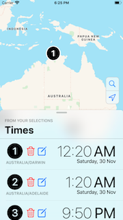
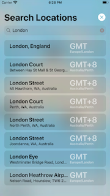

# TimeConverter

An iOS Time Converter app made with Swift for Comp. Sci. (2019). Supports portrait, landscape, iPad and iPhone.

 

## Dependencies

- <https://github.com/SCENEE/FloatingPanel>
- <https://github.com/malcommac/SwiftLocation>
- <https://github.com/urwrstkn8mare/SwiftyPickerPopover> (a fork of <https://github.com/hsylife/SwiftyPickerPopover>)
